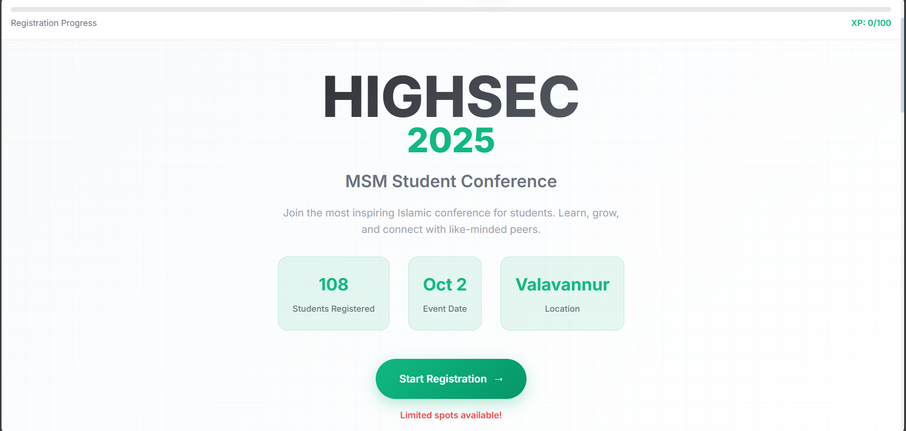

# Registarion Website

A simple minimal website for event registion created using HTML,CSS and JS and backend is connect to a speadsheet with the usage of Google Appscript 

## Backend 
Since this is a regstration website it need a Backend. But I use a appscript to take the data from the regitration form the website and put that data to a spradsheet in my drive. I use google Appscit for that and technically it is a backendless so i can host in free hostinng providers.

But when I use Speedsheet as a storage for data there is an time delay on when someone submite data throgh form and get the Submission Succesfull message on the web So in order to prevent multiple entry I use a loader animation to the submite button 

## 🧩 Data Flow Summary

```text
[ User Form Submission ]
        ↓
 [ JavaScript fetch() ]
        ↓
 [ Google Apps Script Web App ]
        ↓
 [ Google Sheet Storage ]
```


### Main Interface

